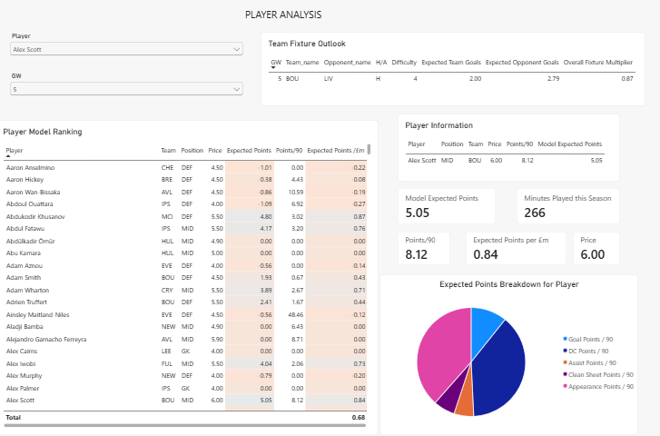
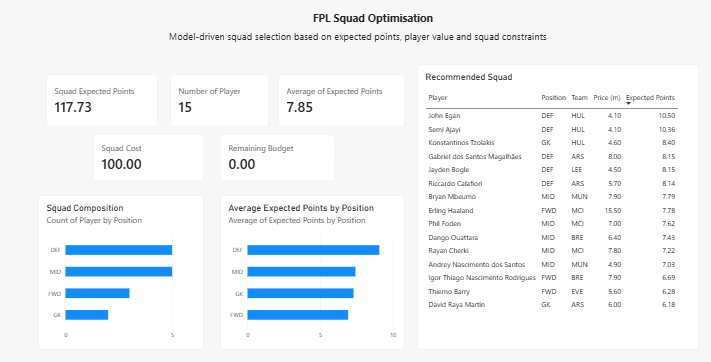

# Fantasy Premier League Analytics & Squad Optimisation

An analytical Fantasy Premier League project developed using Excel and Power BI to evaluate player performance, fixture difficulty, expected points, player value and squad selection.

## Project Overview

This project develops a data-driven FPL analytics model designed to support player evaluation and squad selection.

The project combines:

- Statistical modelling
- Player performance analysis
- Fixture analysis
- Value analysis
- Squad optimisation
- Interactive Power BI visualisation

The Excel model acts as the analytical and optimisation engine, while Power BI provides an interactive decision-support interface.

---

## Dashboard

### FPL Overview


The overview dashboard provides a high-level view of player performance and model outputs, including:

- Top goal scorers
- Top assist providers
- Player rankings
- Price vs model expected points
- Player value

### Player Analysis



The Player Analysis page allows individual players to be investigated using:

- Model expected points
- Price
- Points per 90
- Minutes
- Expected points per £m
- Fixture outlook
- Player model ranking

### Squad Optimisation



The Squad Optimisation page presents the model-selected 15-player squad and evaluates:

- Squad cost
- Remaining budget
- Expected points
- Squad size
- Squad composition
- Expected points by position

---

## Methodology

The model evaluates players using a combination of historical performance, underlying attacking and defensive metrics, player value, starting probability, reliability and fixture difficulty.

Key metrics include:

- Points per 90
- xG per 90
- xA per 90
- xGI per 90
- Points per £m
- xGI per £m
- Starting probability
- Defensive contribution potential
- Bonus potential
- Fixture-adjusted performance

Fixture modelling incorporates team and opponent strength alongside expected goals and home/away status.

The resulting player scores are used to support squad optimisation subject to FPL squad constraints.

More detail is available in the documentation readme.

---

## Tools

- Microsoft Excel
- Microsoft Power BI
- Statistical modelling
- Data analysis
- Data visualisation
- Sports analytics

---

## Project Structure

```text
fpl-excel-analytics-project/
│
├── Excel/
│   └── FPL_Analytics_Model.xlsx
│
├── PowerBI/
│   └── FPL_Analytics_Dashboard.pbix
│
├── Screenshots/
│   ├── overview.png
│   ├── player-analysis.png
│   └── squad-optimisation.png
│
├── Documentation/
│   └── methodology.md
│
└── README.md
